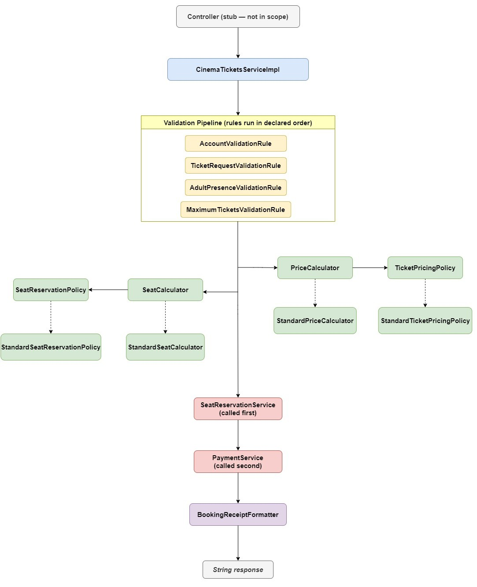
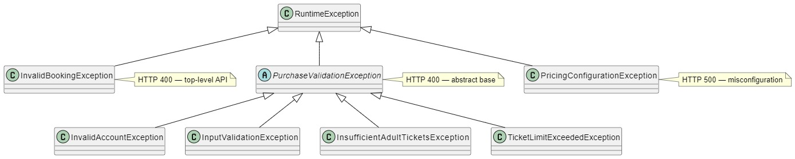
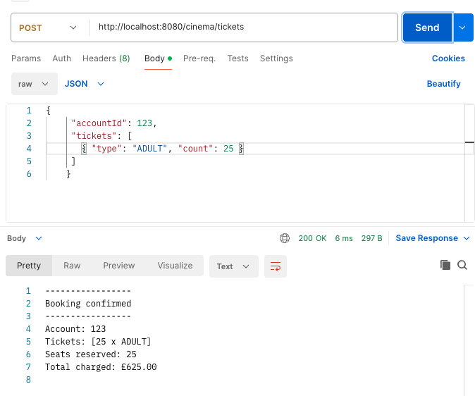
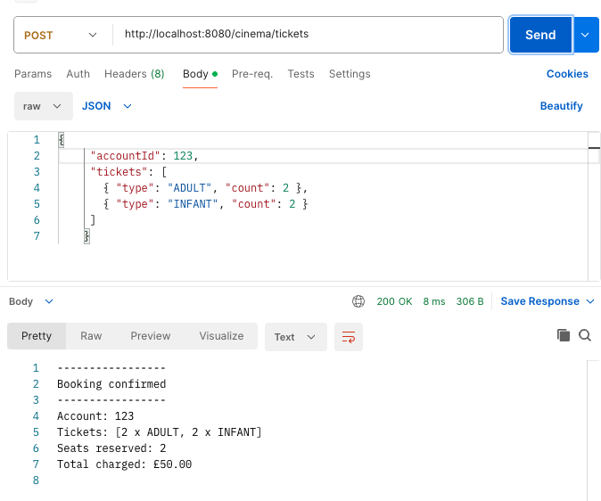
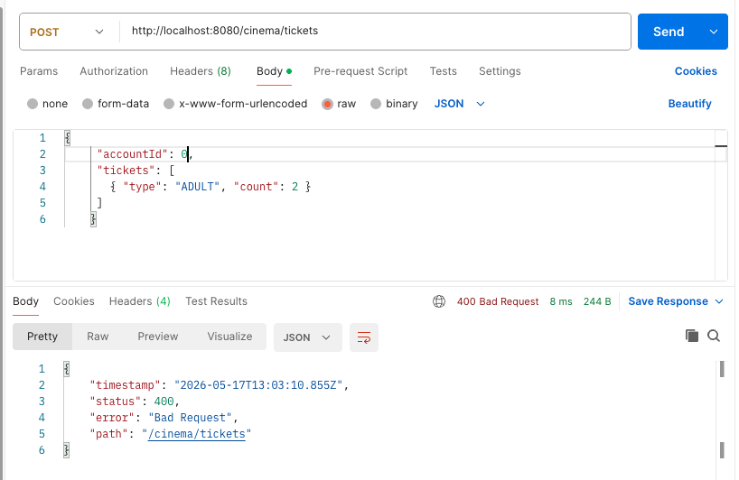
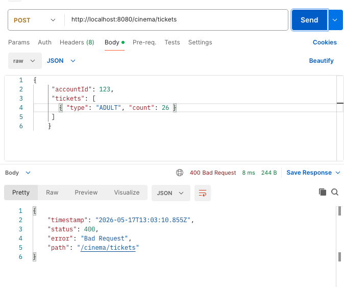
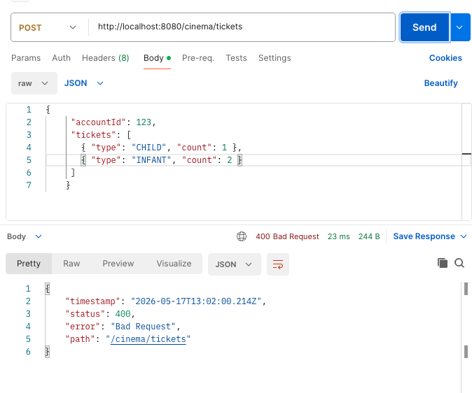
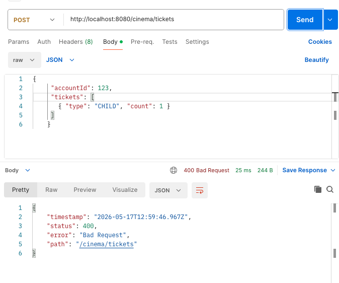

# Cinema Ticket Service

A Java 21 Spring Boot implementation of a cinema ticket purchasing service.

---

## Table of Contents

<!-- TOC -->
- [Cinema Ticket Service](#cinema-ticket-service)
  - [Project Overview](#project-overview)
  - [My Assumptions & Business Rules](#my-assumptions--business-rules)
  - [Ticket Pricing](#ticket-pricing)
  - [My Approach](#my-approach)
  - [Request Flow Diagram](#request-flow-diagram)
  - [Validation Rules](#validation-rules)
  - [Design Decision](#design-decision)
  - [SOLID in Practice](#solid-in-practice)
  - [REST API Best Practices](#rest-api-best-practices)
  - [My Testing Approach](#my-testing-approach)
  - [Trade-offs](#trade-offs)
  - [CI Pipeline](#ci-pipeline)
  - [Output Screenshots](#output-screenshots)
    - [1. Successful response (Adult only)](#1-successful-response-adult-only)
    - [2. Successful response (Adult and Infant mixed)](#2-successful-response-adult-and-infant-mixed)
    - [3. Error - Account Validation](#3-error---account-validation)
    - [4. Error - Max request limit exceeded](#4-error---max-request-limit-exceeded)
    - [5. Error - Adult presence with child and infant](#5-error---adult-presence-with-child-and-infant)
  - [Future Enhancements Scope](#future-enhancements-scope)
<!-- TOC -->

---

# Project Overview

The implemented `TicketService` allows the client to purchase cinema tickets.

Internally it do the following:

1. validates the purchase request through an ordered validation pipeline
2. Calculates the total amount to be paid for the requested tickets
3. Calculates the total number of seats to be reserved for the request
4. Calls third party `PaymentService` to make payment request
5. Calls third party `SeatReservationService` to make seat reservation request
6. Returns the booking receipt after the successful ticket purchase

---

# My Assumptions & Business Rules

1. Account is valid only if the `AccountId` is > 0.
2. The third party services `PaymentService` and `SeatReservationSystem` guarantee no failure.
3. If the same ticket type appear in multiple entries, the count can be aggregated.
4. Ticket counts of 0 or negative are invalid inputs.
5. Infants are not allocated with seats; they sit on accompanying adult's lap only.
6. INFANT or CHILD tickets can not be purchased alone without ADULT ticket.
7. If number of INFANT tickets should not exceed number of ADULT ticket, as each INFANT requires a corresponding ADULT to sit on.
8. The maximum number of tickets in a single purchase should not exceed 25.

---

# Ticket Pricing

| Ticket Type | Price | Seat Reservation |
|-------------|-------|------------------|
| ADULT | 25 | Yes |
| CHILD | 15 | Yes |
| INFANT | 0 | No(Sits on Adult's lap) |

---

# My Approach

As the assessment asked for the service layer implementation, the controller layer is intentionally left empty.

The `CinemaTicketsServiceImpl` is the entry point. It takes an account ID and vararg list of ticket requests.

I've used ordered set of validators to validate the purchase request, following `chain of responsibility pattern`.

Then I calculate pricing and seating as per the criteria and call the external services for payment and seat reservation.

For the successful purchase request, a formatted booking receipt will be returned to the caller.

For the invalid requests, `InvalidBookingException` will be thrown with an HTTP error code **400**.

---

# Request Flow Diagram

<p align="center">
  
</p>

---

# Validation Rules

Rules execute in strict order and the pipeline is fail fast when a validation fails.

| Order | Rule | Failure Condition |
|-------|------|-------------------|
| 1 | `AccountValidationRule` | `accountId` is null or <= 0 |
| 2 | `TicketRequestValidationRule` | Array is null, empty, or contains null/malformed ticket entries with count<=0 |
| 3 | `MaximumTicketsValidationRule` | total tickets > 25 |
| 4 | `AdultPresenceValidationRule` | CHILD or INFANT present with no ADULT or INFANT to ADULT(1:1) ratio is not met |

All failures throw `InvalidBookingException` with a descriptive message.

---

# Design Decision

I designed the components carefully following best engineering practices like SOLID principles, design patterns to build loosely coupled, easily pluggable, individual testable components with no side effects on each others.

## 1. Validation rules

`ValidationRule` is a functional interface which `validate` method to validate `Booking` request.

Each rule is an independent class. A rule does not know about any other role and does not share state.

```java
public interface ValidationRule {
    void validate(Booking booking) throws PurchaseValidationException;
}
```

**Pros:** Each validation rule can be tested independently and new rule can be added/ removed without side effects

---

## 2. Chain of responsibility pattern in Validation pipeline

Validation pipeline is modelled as a `List<ValidationRule>` and injected as bean with explicit order of validation rules in `ValidationConfiguration`.

Spring boot's `@Order` annotation was intentionally avoided as it keeps ordering information scatters across multiple files and harder to understand the sequence of execution of validators.

Declaring the order of validators in a single place makes the validation pipeline visible and easy to follow.

Also any changes to this validation pipeline(rule addition/removal) will only modify the configuration file.

```java
@Bean
public List<ValidationRule> validationRules(
        @Qualifier("accountValidationRule") ValidationRule accountValidation,
        @Qualifier("ticketRequestValidationRule") ValidationRule ticketRequestValidationRule,
        @Qualifier("maximumTicketsValidationRule") ValidationRule maximumTicketsValidation,
        @Qualifier("adultPresenceValidationRule") ValidationRule adultPresenceValidation){
    return List.of(accountValidation, ticketRequestValidationRule, maximumTicketsValidation, adultPresenceValidation);
}
```

**Pros:** Validation pipeline configuration is centralised, strictly ordered chain of rules and easy to maintain.

---

## 3. Externalized configuration for pricing and maximum ticket limit

Prices and the maximum ticket limit live in `BookingProperties` via `@ConfigurationProperties` class.

This keeps configuration values in one place, out of the source code.

```properties
#business configuration
booking.max-tickets-per-purchase=25
booking.pricing.adult=25
booking.pricing.child=15
booking.pricing.infant=0
```

**Pros:** If the business changes a price or a limit, nothing in the service or validation logic needs to change.

---

## 4. Strategy pattern for pricing and seating

`TicketPricingPolicy` and `SeatReservationPolicy` are interfaces.

Following **Strategy Pattern**, the implementations are injected into their respective calculators.

This decouples the implementation from the abstraction.

It also provides flexibility to swap or extend these policy without touching their calculator logic.

**Pros:** The Standard implementations `StandardSeatReservationPolicy`, `StandardTicketPricingPolicy` are the defaults, but future requirements like a **PromotionalPricingPolicy** or **AccessibilitySeatingPolicy** can be swapped in with zero changes to the calculators.

---

## 5. Granular Exception hierarchy

`PurchaseValidationException` is the abstract class which is extended by other subclass validation exceptions.

I created multiple granular validation exceptions intentionally, as it improves observability with meaningful logs.

It will be helpful if future APIs map errors differently.

<p align="center">
  
</p>

**Pros:** Easy to debug and maintainable logging. Better for handling group of exceptions as uniformly or each error differently.

---

## 6. Interface Segration through PriceCalculator and SeatCalculator

`PriceCalculator` and `SeatCalculator` are defined as separate interfaces with dedicated responsibilities.

Their standard implementations can be replaced with alternative calculation strategies in future without impacting the service layer.

**Pros:** This keeps the calculation logic loosely coupled, easier to extend, and independently testable.

---

## 7. Fail Fast Behaviour

The service is intentionally designed around a fail fast approach to detect problems as early as possible and prevent invalid processing.

* Jakarta Bean Validation is used on externalised configuration properties such as ticket pricing and maximum ticket limits. If any required configuration is missing or invalid, the application fails during startup itself rather than allowing runtime failures.

* Similarly, the validation pipeline follows fail fast behaviour. Each validation rule executes in sequence, and as soon as a rule fails, the service immediately throws the corresponding validation exception without continuing to the remaining stages of the booking flow.

* This prevents unnecessary processing, avoids invalid external service calls, and makes failures easier to identify and debug.

---

## 8. No DTO and controller layer

The `purchaseTickets` method in `CinemaTicketService` signature returns `String`.

As TicketService should not be modified as per the assessment instruction, response DTO layer is not implemented.

If the controller layer were implemented, a response DTO would be the right call and keeping this for future enhancement.

---

## 9. Seat reservation before payment

Though we assumed the external services works always without any failure, the service reserves seats before debiting the account.

Reversing a seat reservation is simpler than issuing a refund.

This ordering is explicit in the service implementation and is verified in tests.

---

# SOLID in Practice

## 1. Single Responsibility

Each component is designed to have single responsibility across this project.

### Few examples:

- Each validation rule does one thing.
- `PriceCalculator` only calculates price. It does not decide what the price is.
- `BookingReceiptFormatter` only formats output.

---

## 2. Open/Closed

The classes are designed to be loosely coupled.

They are open to extension but closed to modifications.

### Few examples:

- A new validation rule or ticket type does not require changes to the service or existing rules.
- Register a new `ValidationRule` bean in ValidationConfiguration and it is picked up.

---

## 3. Liskov Substitution

The designed subclasses can be replaced in place of superclass without breaking the expected behaviour.

### Few examples:

- Any `ValidationRule` implementation can be substituted into the pipeline without the service knowing the difference.
- Same for `TicketPricingPolicy` and `SeatReservationPolicy`, where implementations can be substituted without affecting the calling layer.

---

## 4. Interface Segregation

Interfaces are intentionally kept small and focused around a single responsibility.

Nothing implements more than it needs to.

### Examples:

- `ValidationRule`, `TicketPricingPolicy`, and `SeatReservationPolicy` each expose only the behaviour required by their consumers.
- It keeps the contracts simple, maintainable, and easier to test.

---

## 5. Dependency Inversion

The service depends on abstraction over concrete implementations.

This keeps the core workflow loosely coupled and allows implementations to be replaced, extended, or tested independently without affecting the business flow.

### Examples:

- `CinemaTicketServiceImpl` depends on interfaces like `ValidationRule`, `PriceCalculator`, `SeatCalculator` — not on any concrete implementation.

---

# REST API Best Practices

I followed the REST API best practices with proper HTTP Response Code especially in handling exceptions.

- Successful response returns `200 OK`
- Validation exceptions such as `PurchaseValidationException` and `InvalidBookingException` are mapped to `400 BAD_REQUEST` since they are caused by invalid user input.
- `PricingConfigurationException` is mapped to `500 INTERNAL_SERVER_ERROR` because it represents a server side issue.

This keeps client errors and system errors clearly separated.

---

# My Testing Approach

Tests are written using `JUnit5`, `Mockito`, and `AssertJ`.

Each class is tested independently to keep the tests simple and focused.

**Mockito** is used to mock dependencies so the tests only verify the behaviour of the class being tested.

`AssertJ` is used instead of standard JUnit assertions because the assertions are cleaner, easier to read, and provide better failure messages.

---

# CI Pipeline

I have integrated CI pipeline with GitHub Actions that runs on every push to `main` and on every pull request.

```text
Checkout  ->  Setup JDK 21 (Temurin)  ->  mvn clean verify  ->  Upload test results
```

- The `clean verify` goal compiles, runs all tests, and fails the build on any test failure.
- The goal of this pipeline to flag any failing tests and keep the code always ready for the deployment
- please note that no deployment is configured. This pipeline is for validation only.

---

# Output Screenshots

I have added the outputs for different test cases.

These are just for the testing purpose.

With controller and exceptionHandler implementations in the future, these can be enriched with proper DTO response.

---

## 1. Successful response (Adult only)



---

## 2. Successful response (Adult and Infant mixed)



---

## 3. Error - Account Validation



---

## 4. Error - Max request limit exceeded



---

## 5. Error - Adult presence with child and infant





---

# Future Enhancements Scope

The controller layer needs to be implemented in the future.

When the controller layer is added:

- `CinemaTicketsController` maps `POST /cinema/tickets` to `CinemaTicketsService.purchaseTickets`
- A `@RestControllerAdvice` catches `PurchaseValidationException` subclasses and returns HTTP 400
- `PricingConfigurationException` maps to HTTP 500
- The service layer requires no changes

